# Communication Centralizer

An automated system that consolidates messages from multiple platforms (Email, LinkedIn, Handshake, Slack, Discord, etc.) into a single Google Sheet, then uses NLP to detect interview requests and auto-schedules them with Calendly and Google Calendar.

## Features

- Collects messages from:
  - Emails (Gmail/Outlook)
  - LinkedIn DMs (via PhantomBuster)
  - Handshake Messages (via web automation)
  - Slack and Discord
- Stores data in Google Sheets
- Identifies interview requests using spaCy (with LLM integration)
- Auto-schedules interviews with Calendly/Google Calendar

## Requirements

- **Docker** and **Docker Compose** (automatically installed by `setup.sh`)
- **Google Cloud Platform** account (for Sheets/Calendar)
- **PhantomBuster** account (for LinkedIn automation)
- **Calendly** account (for scheduling)
- **Slack** and **Discord** bot tokens (optional connectors)
- **AWS** account (if using the included CI/CD to deploy to an EC2 instance, but you can skip AWS if you just need local usage)

## Quick Setup (Single Best Way)

1. **Clone the repository**:
   ```bash
   git clone https://github.com/your-org/comm-centralizer.git
   cd comm-centralizer
   ```
2. **Run the setup script**:
   ```bash
   ./setup.sh
   ```
   This will:
   - Install Docker and Docker Compose (if missing)
   - Build Docker images
   - Create a Python virtual environment (via UV)
   - Prepare directories and configs
3. **Add credentials** to `config/credentials/` (see that folder's README for details).
4. **Set environment variables** in the `.env` file (you can copy `.env.example` as a starting point).
5. **Reload your shell or log out/log in** if prompted (Docker permissions).
6. **Start the app in development mode**:
   ```bash
   make docker-run-dev
   ```

## CI/CD Pipeline (GitHub Actions)

- Automatically tests, builds, and deploys the application when changes are pushed.
- By default:
  - **`develop`** branch → deploys to staging (if configured).
  - **`main`** branch → deploys to production (if configured).
- **Required GitHub Secrets** (if deploying to AWS):
  - `AWS_ACCESS_KEY_ID`, `AWS_SECRET_ACCESS_KEY`, `AWS_REGION`, `STAGING_EC2_IP`, `PRODUCTION_EC2_IP`, `EC2_SSH_PRIVATE_KEY`
- If you're not using AWS, you can ignore this part and just run locally or adapt it to your environment.

## Testing

Run tests locally or inside Docker:

```bash
# Run all tests (credentials + components)
make test

# Same tests inside Docker container
make docker-test
```

### Adding New Tests

- **Credential Tests**: place them in `tests/credentials/` and update `tests/run_credential_tests.py` if needed.
- **Component Tests**: place them in `tests/component/` following normal pytest naming conventions.

## Project Automation with Makefile

- `make help`: Lists all available commands.
- **Common commands**:
  - `make docker-run-dev` - Start the development environment
  - `make docker-stop` - Stop containers
  - `make docker-logs` - View logs
  - `make docker-build` - Rebuild containers after changes
  - `make uv-add package=xyz` - Add a Python dependency via UV
  - `make test` - Run all tests
  - `make ci-test` - Run all CI tests (linting, type checks, unit tests)

## VS Code Configuration (Optional)

1. Open Command Palette → "Python: Select Interpreter"
2. Choose your Pyenv environment (`~/.pyenv/versions/...`)
3. Restart VS Code

This ensures imports (like `crontab`) are properly recognized.

## Simplified Workflow

1. **Install/Update** everything with `./setup.sh`.
2. **Develop** locally using `make docker-run-dev`.
3. **Push changes** to GitHub to trigger automated tests (and optionally deploy to AWS if you have that configured).
4. **Check logs** with `make docker-logs`.

## Project Structure

```bash
comm-centralizer/
|── scripts/
|   |── .dir_structure_cache.json    # Cache file for directory structure
|   |── deploy_to_ec2.sh             # Script to deploy to EC2 instance
|   |── directory_printer.py         # Python script to print directory structure
|   |── ec2_security_setup.sh        # Script for setting up security on EC2
```

**That's it!** For most use cases, just run `setup.sh` and use `make docker-run-dev` to get going, then rely on the GitHub Actions pipeline to handle testing and production deployment.

## Architecture

```mermaid
graph TD
    subgraph "Input Sources"
        A1["📧 Email"]
        A2["💼 LinkedIn"]
        A3["🤝 Handshake"]
        A4["💬 Slack/Discord"]
    end

    subgraph "Integration Layer"
        B["🔌 Connectors"]
    end

    subgraph "Core Processing"
        C["⚙️ Central Processing"]
        D["🧠 NLP/Classification"]
    end

    subgraph "Output Systems"
        E["📊 Google Sheets<br/>(Storage)"]
        F["📅 Calendly<br/>(Scheduling)"]
        G["📆 Google Calendar"]
    end

    A1 --> B
    A2 --> B
    A3 --> B
    A4 --> B

    B --> C
    C --> D

    D -->|Store Message Data| E
    D -->|Schedule Interview| F
    F --> G

    %% Styling
    classDef sources fill:#f9d5e5,stroke:#333,stroke-width:1px;
    classDef integration fill:#eeeeee,stroke:#333,stroke-width:1px;
    classDef processing fill:#d3e5ef,stroke:#333,stroke-width:1px;
    classDef outputs fill:#e5f5e0,stroke:#333,stroke-width:1px;

    class A1,A2,A3,A4 sources;
    class B integration;
    class C,D processing;
    class E,F,G outputs;
```



# Contributing

1. For the repository
2. Create a feature branch (`git checkout -b feature/amazing-feature`)
3. Commit your changes (`git commit -m 'Add amazing feature'`)
4. Push to the branch (`git push origin feature/amazing-feature`)
5. Create a pull request

Please ensure you follow our coding standards (linting and type checking should pass).

# Adding New Connectors

To add a new connector, you can follow these steps:

1. Create a new file in the `src/connectors/` directory.
2. Implement the required interface methods (see existing connectors for examples)
3. Add credentials handling in `config/credentials/`
4. Update the main application to use your new connector
5. Add tests in `tests/component/` and `test/credentials`

# Troubleshooting

## Common Issues

- **Docker Permissions**: Ensure you've followed the setup instructions and reloaded your shell. Run `su - $USER` before running docker commands.
- **Authentication failures**: Double-check your credentials in `config/credentials/` and `.env`.
- **Scheduling not working**: Ensure your Calendly and Google Calendar are properly set up.

For more issues, check the logs with `make docker-logs`.
