# Communication Centralizer

An automated system that consolidates messages from multiple platforms (Email, LinkedIn, Handshake, Slack, Discord, etc.) into a single Google Sheet, then uses NLP to detect interview requests and auto-schedules them with Calendly and Google Calendar.

## Features

- Collects messages from:
  - Emails (Gmail/Outlook)
  - LinkedIn DMs (via PhantomBuster)
  - Handshake Messages (via web automation)
  - Slack and Discord
- Stores data in Google Sheets
- Identifies interview requests using spaCy (with LLM integration)
- Auto-schedules interviews with Calendly/Google Calendar

## Requirements

- **Docker** and **Docker Compose** (automatically installed by `setup.sh`)
- **Google Cloud Platform** account (for Sheets/Calendar)
- **PhantomBuster** account (for LinkedIn automation)
- **Calendly** account (for scheduling)
- **Slack** and **Discord** bot tokens (optional connectors)
- **AWS** account (if using the included CI/CD to deploy to an EC2 instance, but you can skip AWS if you just need local usage)

## Quick Setup

1. **Clone the repository**:
   ```bash
   git clone https://github.com/your-org/comm-centralizer.git
   cd comm-centralizer
   ```
2. **Run the setup script**:
   ```bash
   ./setup.sh
   ```
   This will:
   - Install Docker and Docker Compose (if missing)
   - Build the Docker development container with Python 3.11
   - Configure Docker-based pre-commit hooks
   - Prepare necessary directories and configs
3. **Add credentials** to `config/credentials/` (see that folder's README for details).
4. **Set environment variables** in the `.env` file (you can copy `.env.example` as a starting point).
5. **Reload your shell or log out/log in** if prompted (Docker permissions).
6. **Start the app in development mode**:
   ```bash
   make docker-run-dev
   ```

## Docker-Based Development Workflow

All development is done inside Docker containers to ensure consistency:

1. **Start a development shell**:
   ```bash
   make docker-shell
   ```
2. **Run the application in development mode**:

   ```bash
   make docker-run-dev
   ```

3. **Run tests inside Docker**:

   ```bash
   make docker-test
   ```

4. **Run linting and code checks inside Docker**:

   ```bash
   make docker-lint
   make docker-pytype
   ```

5. **Build Docker images**:
   ```bash
   make docker-build-dev    # Development image
   make docker-build-prod   # Production image
   ```

## CI/CD Pipeline (GitHub Actions)

- Automatically tests, builds, and deploys the application when changes are pushed.
- By default:
  - **`develop`** branch → deploys to staging (if configured).
  - **`main`** branch → deploys to production (if configured).
- **Required GitHub Secrets** (if deploying to AWS):
  - `AWS_ACCESS_KEY_ID`, `AWS_SECRET_ACCESS_KEY`, `AWS_REGION`, `STAGING_EC2_IP`, `PRODUCTION_EC2_IP`, `EC2_SSH_PRIVATE_KEY`
- If you're not using AWS, you can ignore this part and just run locally or adapt it to your environment.

## Testing

All tests run inside Docker to ensure consistency:

```bash
# Run all tests in Docker
make docker-test

# Run tests with specific options
make docker-test PYTEST_ARGS="-v tests/component/test_specific.py"
```

### Adding New Tests

- **Credential Tests**: place them in `tests/credentials/` and update `tests/run_credential_tests.py` if needed.
- **Component Tests**: place them in `tests/component/` following normal pytest naming conventions.

## Project Automation with Makefile

- `make help`: Lists all available commands.
- **Common commands**:
  - `make docker-run-dev` - Start the development environment
  - `make docker-shell` - Open a shell in the Docker container
  - `make docker-stop` - Stop containers
  - `make docker-logs` - View logs
  - `make docker-build-dev` - Rebuild development container
  - `make docker-test` - Run tests in Docker
  - `make docker-lint` - Run linting in Docker
  - `make docker-pytype` - Run type checking in Docker
  - `make ci-test` - Run all CI tests

## VS Code Development (Optional)

For the best VS Code experience with Docker-based development:

1. Install the "Remote - Containers" extension
2. Use Command Palette → "Remote-Containers: Attach to Running Container..."
3. Select your development container
4. Edit code directly within the container

Alternatively, you can create a `.devcontainer/devcontainer.json` file with:

```json
{
  "name": "Python 3.11 Development",
  "dockerComposeFile": "../docker-compose.dev.yml",
  "service": "app",
  "workspaceFolder": "/app"
}
```

## Simplified Workflow

1. **Install/Update** everything with `./setup.sh`
2. **Develop** using `make docker-shell` or `make docker-run-dev`
3. **Test** with `make docker-test` and `make docker-lint`
4. **Push changes** to GitHub to trigger automated tests and deployment
5. **Check logs** with `make docker-logs`

## Git Pre-Commit Hooks

The setup automatically configures Git hooks to run pre-commit checks inside Docker, ensuring:

- Code is properly formatted (Black)
- Type checking passes (Pytype with Python 3.11)
- Linting passes (Flake8, Ruff)
- Other checks run as configured in `.pre-commit-config.yaml`

## Project Structure

```bash
comm-centralizer/
├── scripts/
|   ├── .dir_structure_cache.json    # Cache file for directory structure
|   ├── deploy_to_ec2.sh             # Script for deploying to EC2
|   ├── directory_printer.py         # Python script for printing directory structure
|   ├── docker-entrypoint.sh         # Docker entrypoint script
|   ├── docker-pre-commit.sh         # Pre-commit script for Docker
|   ├── ec2_security_setup.sh        # Script for setting up security on EC2
|   ├── llm_type_annotations.log     # Log file for type annotations
|   ├── readme_update.log            # Log file for updating README
|   ├── schedule_job.py              # Script for scheduling jobs
|   ├── setup_env_credentials.sh     # Script for setting up environment credentials
|   ├── setup_monitoring.sh          # Script for setting up monitoring
|   └── type_annotate_python_files.py    # Python script for type annotating Python files
├── .ruff_cache/
|   ├── .gitignore                  # Git ignore file for cache directory
|   ├── CACHEDIR.TAG                # Cache directory tag
|   └── content/                    # Cache content directory
├── terraform/
|   └── main.tf                      # Terraform main configuration file
├── config/
|   ├── config.py                   # Configuration file
|   └── credentials/
|       ├── .gitkeep                # Git keep file for credentials directory
|       ├── README.md               # Credentials README
|       ├── gmail_token.json        # Gmail token file
|       └── google_credentials.json  # Google credentials file
├── src/
|   ├── __init__.py                  # Python package initialization file
|   ├── main.py                      # Main Python script
|   ├── automation/
|   |   ├── __init__.py              # Automation package initialization file
|   |   ├── puppeteer_scripts/
|   |   |   ├── handshake.js        # Puppeteer script for handshake
|   |   |   ├── index.ts            # TypeScript index file
|   |   |   └── utils.js            # JavaScript utility functions
|   |   └── selenium_scripts/
|   |       └── utils.py            # Selenium utility functions
|   ├── config/
|   |   └── environment.py          # Environment configuration file
|   ├── connectors/
|   |   ├── __init__.py              # Connectors package initialization file
|   |   ├── discord_connector.py    # Discord connector implementation
|   |   ├── email_connector.py      # Email connector implementation
|   |   ├── handshake_connector.py  # Handshake connector implementation
|   |   ├── linkedin_connector.py   # LinkedIn connector implementation
|   |   └── slack_connector.py      # Slack connector implementation
|   ├── processing/
|   |   ├── __init__.py              # Processing package initialization file
|   |   ├── message_classifier.py   # Message classifier implementation
|   |   └── nlp_processor.py        # NLP processor implementation
|   ├── scheduling/
|   |   ├── __init__.py              # Scheduling package initialization file
|   |   ├── calendly.py             # Calendly scheduling implementation
|   |   └── google_calendar.py      # Google Calendar scheduling implementation
|   └── storage/
|       ├── __init__.py              # Storage package initialization file
|       └── google_sheets.py        # Google Sheets storage implementation
├── .pytype/
|   ├── .gitignore                  # Git ignore file for Pytype
|   ├── .ninja_log                  # Ninja log file
|   ├── build.ninja                 # Ninja build file
|   ├── imports/
|   |   ├── default.pyi             # Default Pyi file
|   |   ├── tst.imports             # Test imports file
|   |   └── type_annotate_python_files.imports  # Type annotation imports file
|   └── pyi/
|       └── type_annotate_python_files.pyi  # Type annotation Pyi file
├── tests/
|   ├── __init__.py                 # Tests package initialization file
|   ├── conftest.py                 # Pytest configuration file
|   ├── component/
|   |   ├── README.md               # Component tests README
|   |   ├── test_automation.py      # Automation tests
|   |   ├── test_connectors.py      # Connectors tests
|   |   ├── test_processing.py      # Processing tests
|   |   ├── test_scheduling.py      # Scheduling tests
|   |   └── test_storage.py         # Storage tests
|   └── credentials/
|       ├── README.md               # Credentials tests README
|       ├── test_calendly_credentials.py  # Calendly credentials test
|       ├── test_discord_credentials.py   # Discord credentials test
|       ├── test_email_credentials.py     # Email credentials test
|       ├── test_openai_credentials.py    # OpenAI credentials test
|       ├── test_phantombuster_credentials.py  # Phantombuster credentials test
|       ├── test_sheets_credentials.py    # Google Sheets credentials test
|       └── test_slack_credentials.py     # Slack credentials test
├── .eslintrc.js                    # ESLint configuration file
├── .pre-commit-config.yaml         # Pre-commit configuration file
├── Dockerfile                      # Dockerfile for development
├── Dockerfile.prod                 # Dockerfile for production
├── Makefile                        # Makefile for project
├── README.md                       # Project documentation
├── REFERENCES.md                   # References for project
├── TODO.md                         # TODO list for project
├── TODOPROMPTS.txt                 # TODO prompts for project
├── comm_centralizer.log            # Project log file
├── docker-compose.dev.yml          # Docker Compose file for development
├── docker-compose.prod.yml         # Docker Compose file for production
├── docker-compose.yml              # Docker Compose file
├── monkeytype.sqlite3              # Monkeytype SQLite database
├── package.json                    # Node.js package file
├── pyproject.toml                  # Python project configuration file
├── pytest.ini                      # Pytest configuration file
├── setup.sh                        # Setup script
└── tsconfig.json                   # TypeScript configuration file
```

**That's it!** For most use cases, just run `setup.sh` and use `make docker-run-dev` for development, then rely on the GitHub Actions pipeline to handle testing and production deployment.

## Architecture

```mermaid
graph TD
    subgraph "Input Sources"
        A1["📧 Email"]
        A2["💼 LinkedIn"]
        A3["🤝 Handshake"]
        A4["💬 Slack/Discord"]
    end

    subgraph "Integration Layer"
        B["🔌 Connectors"]
    end

    subgraph "Core Processing"
        C["⚙️ Central Processing"]
        D["🧠 NLP/Classification"]
    end

    subgraph "Output Systems"
        E["📊 Google Sheets<br/>(Storage)"]
        F["📅 Calendly<br/>(Scheduling)"]
        G["📆 Google Calendar"]
    end

    A1 --> B
    A2 --> B
    A3 --> B
    A4 --> B

    B --> C
    C --> D

    D -->|Store Message Data| E
    D -->|Schedule Interview| F
    F --> G

    %% Styling
    classDef sources fill:#f9d5e5,stroke:#333,stroke-width:1px;
    classDef integration fill:#eeeeee,stroke:#333,stroke-width:1px;
    classDef processing fill:#d3e5ef,stroke:#333,stroke-width:1px;
    classDef outputs fill:#e5f5e0,stroke:#333,stroke-width:1px;

    class A1,A2,A3,A4 sources;
    class B integration;
    class C,D processing;
    class E,F,G outputs;
```



# Contributing

1. Fork the repository
2. Create a feature branch (`git checkout -b feature/amazing-feature`)
3. Commit your changes (`git commit -m 'Add amazing feature'`)
4. Push to the branch (`git push origin feature/amazing-feature`)
5. Create a pull request

Please ensure you follow our coding standards (linting and type checking should pass).

# Adding New Connectors

To add a new connector, you can follow these steps:

1. Create a new file in the `src/connectors/` directory.
2. Implement the required interface methods (see existing connectors for examples)
3. Add credentials handling in `config/credentials/`
4. Update the main application to use your new connector
5. Add tests in `tests/component/` and `test/credentials`

# Troubleshooting

## Common Issues

- **Docker Permissions**: Ensure you've followed the setup instructions and reloaded your shell. Run `su - $USER` before running docker commands.
- **Authentication failures**: Double-check your credentials in `config/credentials/` and `.env`.
- **Scheduling not working**: Ensure your Calendly and Google Calendar are properly set up.
- **Pre-commit hooks failing**: Run `make docker-lint` to see detailed errors

For more issues, check the logs with `make docker-logs`.
